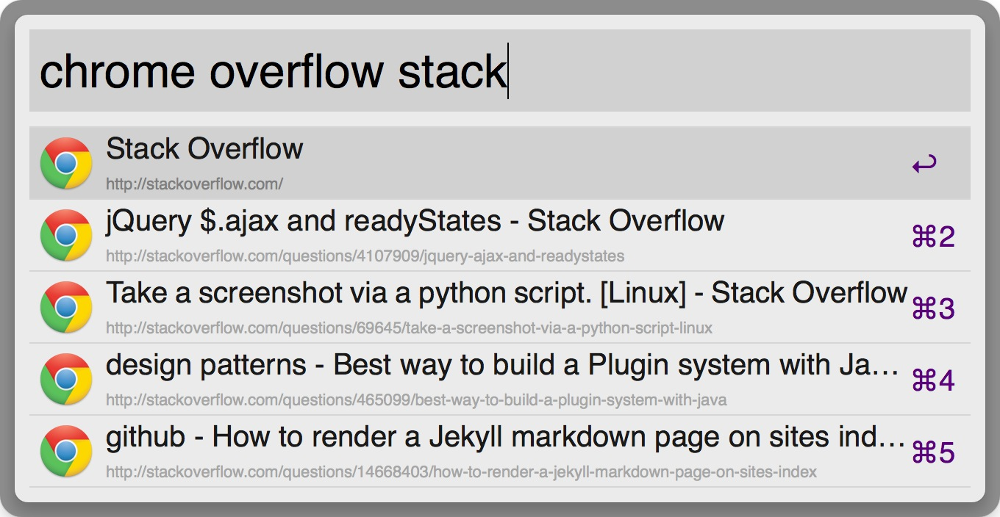

Alfred Workflows
================

Workflows for Alfred 2

Downloads
---------

[Chrome Bookmarks](https://github.com/Witcher42/alfred-workflows/blob/master/chrome-bookmarks/zip/chrome-bookmarks.alfredworkflow?raw=true)


Chrome Bookmarks
----------------

### Introduction

Requirements: Python 2.7.x or above.

This workflow helps you search Google Chrome bookmarks by using a ```chrome``` (Google Chrome) or ```chromium``` (Chromium) keyword:

[](https://raw.github.com/mdreizin/alfred-workflows/master/chrome-bookmarks/zip/chrome-bookmarks.alfredworkflow)
[](https://raw.github.com/mdreizin/alfred-workflows/master/chrome-bookmarks/zip/chrome-bookmarks.alfredworkflow)

**[New]** This project supports simple fuzzy match, so you can use many keywords to search your bookmarks. <small>I don't use chromium, add it yourself as you like.</small>

[](./img/chrome_fuzzy.png)

Also you can specify which profile will be used by using a ```chrome-profiles``` (Google Chrome) or ```chromium-profiles``` (Chromium) keyword:

[](https://raw.github.com/mdreizin/alfred-workflows/master/chrome-bookmarks/zip/chrome-bookmarks.alfredworkflow)
[](https://raw.github.com/mdreizin/alfred-workflows/master/chrome-bookmarks/zip/chrome-bookmarks.alfredworkflow)


